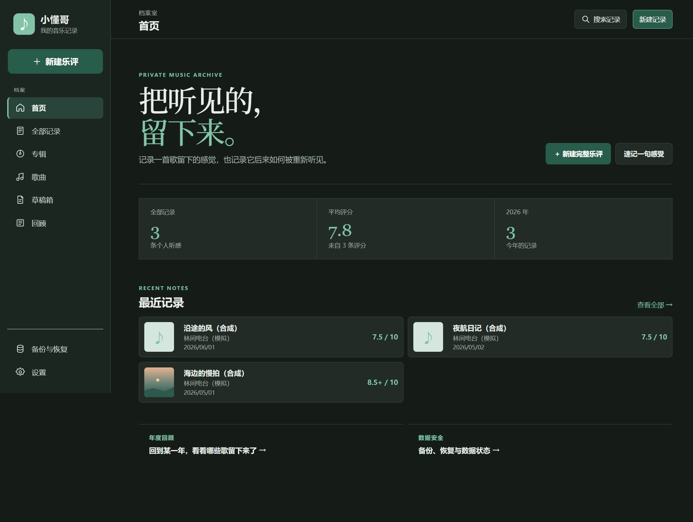
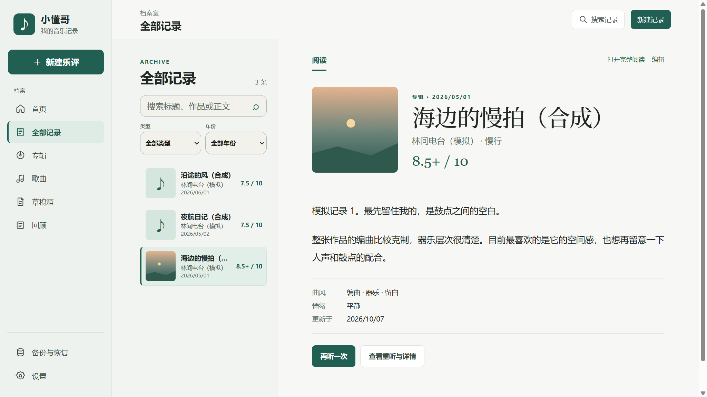

# 小懂哥 · Windows 桌面版

把听过的歌、写下的感受和隔一段时间的重听，留在自己的电脑里。

小懂哥是一款以本地档案为主的私人音乐记录应用。Windows 版提供独立桌面窗口、档案双栏阅读、乐评与速记、重听对照和年度回顾。本仓库独立维护 Windows 源码及发行包；[手机端在另一个仓库](https://github.com/Yvesyzy/xiaodongge)。

[下载 Windows 版](https://github.com/Yvesyzy/xiaodongge-windows/releases/latest) · [使用说明](desktop/codex_README.md) · [更新记录](CHANGELOG.md) · [MIT License](LICENSE)





截图使用合成演示记录。

## 下载与运行

当前版本 **3.1.1**，提供 Windows x64 安装包与便携 ZIP，面向 Windows 10 / 11；实际验收系统为 Windows 11 x64。

推荐在 [Releases](https://github.com/Yvesyzy/xiaodongge-windows/releases) 下载文件名包含 `setup_unsigned` 的 `.exe` 及同名 `.exe.sha256.txt`。安装器默认装到当前用户的 `%LOCALAPPDATA%\Programs\xiaodongge-windows`，提供开始菜单入口和可选桌面快捷方式，无需管理员权限。安装后从开始菜单打开「小懂哥」。

如需便携运行：

1. 在 [Releases](https://github.com/Yvesyzy/xiaodongge-windows/releases) 下载 ZIP 和对应的 `.zip.sha256.txt` 校验文件。
2. 将 ZIP **完整解压**到自己的应用目录。
3. 双击 `codex_xiaodongge.exe`。同目录的 DLL、`locales` 和 `resources` 必须保留。

运行发行包不需要安装 Node.js、npm 或数据库。**当前安装包和便携包均未签名**，正式代码签名仍需发布者证书；暂无自动更新。

在 ZIP 所在目录用 PowerShell 验证下载完整性：

```powershell
Get-ChildItem -Filter '*.zip' | Get-FileHash -Algorithm SHA256
Get-Content -Path '*.zip.sha256.txt'
```

将 ZIP 的 SHA-256 与对应校验文件中的值逐字核对。安装包用同样方式核对 `.exe` 和 `.exe.sha256.txt`。

## 可以做什么

- **记录音乐**：完整乐评、速记、封面、标签、听歌情境和草稿。
- **六项评分**：制作、词、曲、人声、原创性、共鸣；保留旧总分、加减号和旧版词曲分的原意。
- **整理档案**：搜索、类型与年份筛选、列表和阅读双栏、专辑与歌曲时间轴。
- **重听与回顾**：重听对照、月度和年度回顾、年度专辑榜单及图片导出。
- **桌面原生能力**：文件保存对话框、文件夹选择、剪贴板、当前播放读取和本机截图 OCR。
- **本地备份**：支持 JSON v1–v6，导入前预演差异、恢复失败回滚和撤销上次导入。
- **阅读设置**：深浅主题、字号设置和桌面页面缩放。

## 网易云当前播放

在网易云音乐的 **设置 → 系统** 勾选 **开启SMTC**，保持歌曲播放，再在小懂哥点击「读取当前播放」。暂停时不会作为当前播放读取。

Windows 系统媒体会话未给出专辑或完整合作歌手时，小懂哥会只读本机网易云播放队列，在歌曲名和歌手精确、唯一匹配且没有专辑冲突时补齐。队列缺失、损坏或匹配有歧义时保留系统结果，可以手动校正。读取不会自动保存正式乐评，也不会覆盖已有手填信息。

其他播放器需要提供 Windows 系统媒体会话；本次未逐一验收。OCR 语言取决于系统已安装的语言包，可在「本机诊断」查看。

## 数据、备份与更新

正式档案位于：

```text
%APPDATA%\xiaodongge-windows\archive\music_feelings_archive.sqlite
```

草稿、主题和阅读偏好位于同一应用数据目录中的 Chromium 存储。便携程序所在目录与个人数据目录分开，移动程序目录不会随之移动档案。

从安卓版迁移时，先在手机导出包含封面的 JSON，在 Windows 的「备份与恢复」中选择文件并预演差异，核对后再导入。**导入会整体替换本机档案**，请保留原备份；JSON v1–v5 缺少草稿时保留本机草稿，v6 按备份替换草稿。两端通过手动 JSON 备份迁移，没有云同步。

更新时先导出 JSON 并正常关闭旧版。安装版运行新版安装器覆盖升级，便携版把新版解压到新目录运行。两种方式沿用同一应用数据目录，请勿同时运行。通过 Windows「已安装的应用」卸载安装版时保留档案、草稿和偏好；复制程序目录不能替代备份。

本地记录可以离线使用。当前播放的目录补全会使用 Apple iTunes；仅在手动选择城市后请求 Open-Meteo 天气。本机网易云队列补全与截图 OCR 不需要联网。

## 从源码构建

使用 **Windows x64、Node.js 24 或以上版本、npm、PowerShell 7**。原生媒体会话和 OCR 辅助程序使用系统自带的 Windows PowerShell 5.1。

```powershell
git clone https://github.com/Yvesyzy/xiaodongge-windows.git
cd xiaodongge-windows
npm.cmd ci
node node_modules/electron/install.js
npm.cmd run typecheck
npm.cmd test
npm.cmd run windows:build
npm.cmd run windows:start
```

生成便携 ZIP：

```powershell
npm.cmd run windows:package
```

产物写入被 Git 忽略的 `release/`：完整运行目录、ZIP、SHA-256 文件及 `codex_windows_latest.json`。打包脚本直接从源码构建页面，逐项核对 ZIP 中每个交付文件的大小和 SHA-256。

Electron 运行时通过上面的安装命令单独下载；保留 Electron 包附带的校验和。

### 构建安装包与签名

额外安装 Inno Setup 7。先生成便携包，再构建安装包；打包前逐项核对便携目录完整性，新的暂存副本中更新使用说明，不改动已有 ZIP 或运行目录。

显式生成未签名安装包：

```powershell
npm.cmd run windows:installer -- -AllowUnsigned
```

签名构建还需要 Windows SDK 的 SignTool，以及 Windows 个人证书存储中有私钥的受信任代码签名证书。由证书持有人安全导入证书后，以完整指纹指定；不要把 PFX、密码或私钥提交到 Git。

```powershell
Get-ChildItem Cert:\CurrentUser\My -CodeSigningCert | Select-Object Subject, Thumbprint, NotAfter
npm.cmd run windows:installer -- -CertificateThumbprint '证书的完整40位十六进制指纹'
```

机器证书存储可额外传 `-CertificateStore LocalMachine`；工具不在默认安装位置时，可指定 `-CompilerPath` 和 `-SignToolPath`。签名流程使用 SHA-256 与 RFC 3161 时间戳，并校验程序、安装器和卸载器的可信签名、指定指纹及时间戳。缺少证书或校验失败时停止，不自动降级为未签名包。本次尚无发布者证书，真实证书签名流程未执行。

产物位于 `release/` 中的新目录，包含安装器、SHA-256、清单及构建暂存目录；最新正式构建记录为 `codex_windows_installer_latest.json`。方案见 [安装包设计与验收范围](docs/codex_windows_installer_design.md)。

## 验证

```powershell
npm.cmd run windows:check
```

该脚本在 `release/` 内创建独立 profile 和合成记录，不读取正式个人档案。覆盖 SQLite、草稿、备份预演/恢复/回滚/撤销、原生导出、OCR 和深浅主题布局。将 `release/codex_windows_latest.json` 中 `executable` 的实际路径作为参数传给 `windows:check`，还会检查便携目录搬移及离线冷启动、保存与导出。

`npm.cmd test` 包含共享备份/分析规则、Windows SQLite 和网易云队列补全的单元测试。真实网易云播放检查使用 `node scripts/codex_check_windows_playback.mjs`；运行前保持网易云播放，该检查会暂停并恢复播放。

本次发行的验证范围见 [Release 说明](docs/codex_release_v3.1.1.md)。Windows 10 和个人 Android 备份的跨端迁移仍需实际设备验收。

安装器的最小回归使用独立安装身份、开始菜单组、安装目录和合成数据 profile，自动安装、启动、覆盖升级和卸载，不操作正式安装或个人档案：

```powershell
npm.cmd run windows:installer -- -AllowUnsigned -TestIdentity
npm.cmd run windows:installer:check
```

检查结果写入 `release/codex_installer_qa_*/codex_installer_checks.json`。验收会在当前 Windows 用户下临时创建专用开始菜单组与卸载登记，结束后移除。检查包括文件哈希、快捷方式、系统卸载登记、SQLite 与 Chromium 存储升级后持久化，以及卸载后的数据与用户自建文件保留。

## 源码结构

```text
desktop/       Electron 主进程、受限桥接、SQLite、WinRT 辅助程序及桌面界面
mobile/src/    Windows 复用的记录、回顾、备份与阅读组件
mobile/public/ 字体授权说明
shared/        备份、听歌情境与分析规则及单元测试
scripts/       Windows 构建、验收与媒体会话检查
docs/          发行说明与界面截图
```

`mobile/` 保留原有相对导入路径，仓库无需手机端源码目录、Android SDK 或手机端仓库才能构建。Windows 与手机端今后各自提交、发布。

## 授权

项目源码采用 [MIT License](LICENSE)。Electron、Chromium 及所用字体的第三方授权说明随发行包保留。
